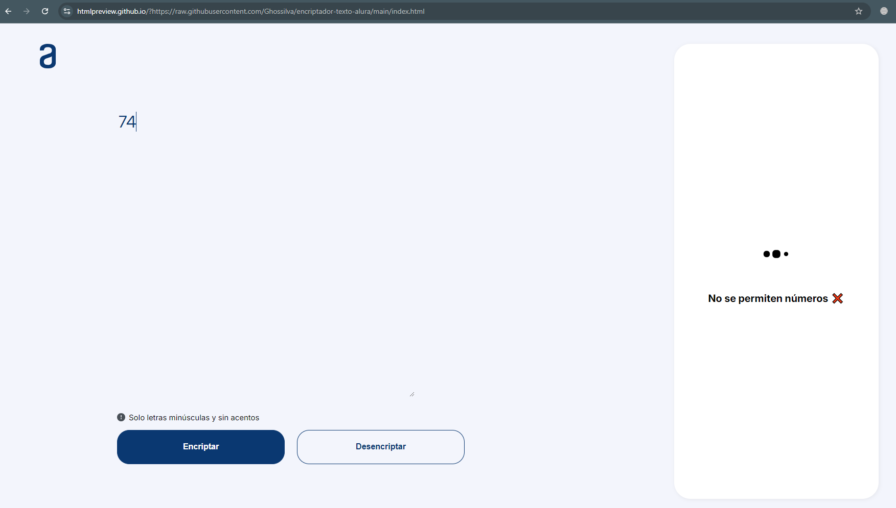

<h1>Encriptador/Desencriptador de Texto - Alura Challenge</h1>

<h2>Descripción</h2>

Este proyecto es una solución al desafío de Alura para crear una aplicación web simple que encripta y desencripta texto siguiendo un conjunto específico de reglas. La aplicación permite a los usuarios ingresar texto en minúsculas y obtener su versión encriptada o desencriptada.

<h2>Funcionalidades</h2>

-Encriptación: Convierte las vocales "a", "e", "i", "o" y "u" en sus respectivas cadenas de sustitución (ai, enter, imes, ober, ufat).
-Desencriptación: Revierte el proceso de encriptación, restaurando el texto original.
-Botón "Copiar": Permite copiar fácilmente el texto encriptado o desencriptado.
-Interfaz sencilla: La aplicación cuenta con una interfaz intuitiva que facilita su uso.

**Implementé una expresión regular para validar la entrada de datos y evitar la inclusión de caracteres numéricos.**

<h2>Tecnologías utilizadas</h2>

HTML: Estructura de la página web.
CSS: Estilos y diseño de la interfaz.
JavaScript: Lógica de encriptación y desencriptación.

<h2>Instrucciones de uso</h2>

Clona el repositorio:

git clone https://github.com/Ghossilva/encriptador-texto-alura.git

1. Abre el archivo index.html en tu navegador.
2. Ingresa el texto que deseas encriptar o desencriptar en el campo correspondiente.
3. Selecciona la opción de encriptar o desencriptar.
4. Haz clic en el botón para realizar la operación.
5. El resultado se mostrará en la pantalla.
6. Para copiar el resultado, haz clic en el botón "Copiar".

<h2>Reglas de encriptación</h2>

Tabla de Sustitución

| Letra original | Letra encriptada |
|---|---|
| a | ai |
| e | enter |
| i | imes |
| o | ober |
| u | ufat |

<h2>Consideraciones</h2>

La aplicación solo funciona con letras minúsculas y no admite caracteres especiales o acentos.
El algoritmo de encriptación es sencillo y está diseñado para fines educativos.
Contribuciones

Las contribuciones son bienvenidas. Si encuentras algún error o deseas agregar nuevas funcionalidades, por favor, abre un issue. Estoy aprendiendo. 
